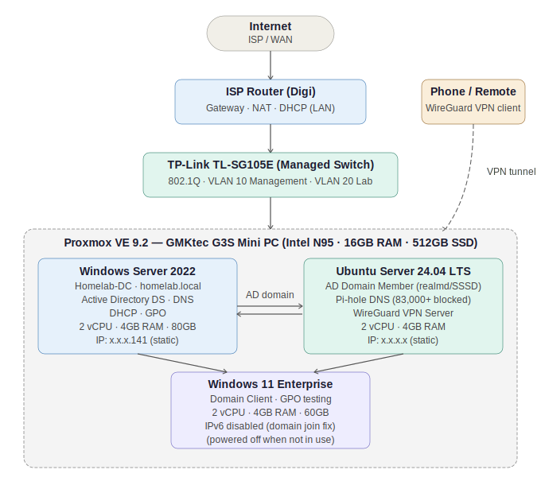
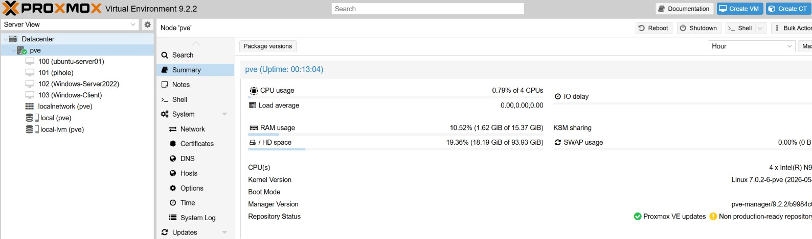
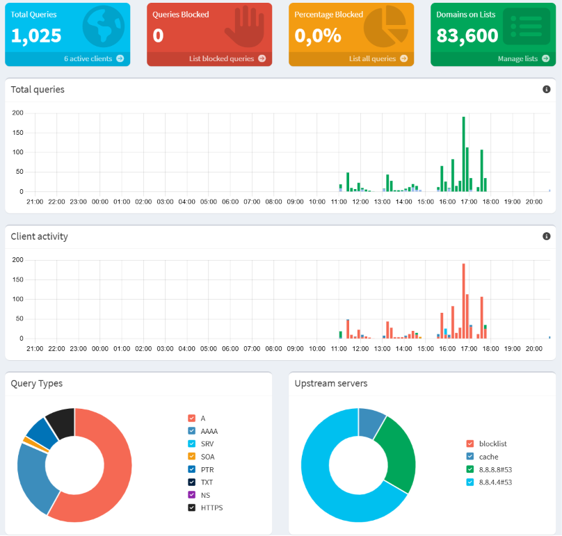

# homelab-infrastructure
Personal homelab build on Proxmox VE - Windows Server, Active Directory, Linux, WireGuard VPN, VLANs, Pi-hole
# Homelab Infrastructure

Personal homelab built from scratch to develop and demonstrate practical skills in system administration, networking, and virtualization.

## Hardware

- **Device**: GMKtec G3S Mini PC
- **CPU**: Intel N95 (4 cores)
- **RAM**: 16GB
- **Storage**: 512GB SSD
- **Switch**: TP-Link TL-SG105E (managed, 802.1Q VLAN support)

## Stack

| Technology | Role |
|---|---|
| Proxmox VE 9.2 | Hypervisor / Virtualization platform |
| Windows Server 2022 | Domain Controller, DNS, DHCP |
| Active Directory DS | User, group and policy management |
| Ubuntu Server 24.04 | Linux domain member, Pi-hole, WireGuard |
| Pi-hole | DNS filtering (83,000+ domains blocked) |
| WireGuard | VPN server with Pi-hole DNS over tunnel |
| 802.1Q VLANs | Network segmentation (Management / Lab) |

## What's Built

- Proxmox VE hypervisor with multiple VMs
- Windows Server 2022 Domain Controller (homelab.local)
- Active Directory with Organizational Units, users, security groups and Group Policies
- DHCP server with configured scope
- Ubuntu Server joined to Active Directory domain via realmd and SSSD
- Windows 11 Enterprise client joined to domain
- WireGuard VPN with NAT and remote access
- Pi-hole DNS filtering integrated across entire home network
- 802.1Q VLAN segmentation on managed switch
  
  ## Network Diagram

## Status

🟢 Active — ongoing development

## Documentation

Detailed documentation for each component available in the folders above.

## Screenshots

### Proxmox VE Dashboard

### Pi-hole DNS Filtering

